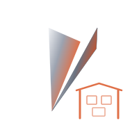

# vize_musea

**Musea** - Component gallery and documentation for Vize Vue components.

  

## Name Origin

**Musea** (plural of museum) represents a gallery space where art is displayed and documented. Similarly, `vize_musea` provides a gallery for Vue components, allowing developers to view and interact with components in isolation - similar to Storybook.

## Features

- Component gallery for Vue components
- Interactive documentation
- Component playground
- Visual regression testing support

## Status

This crate is currently under development.

## License

MIT
